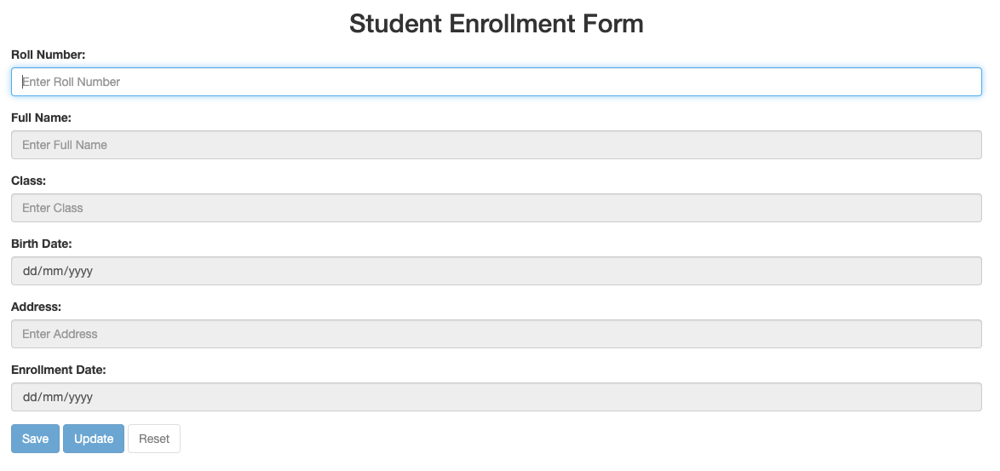

# Student Enrollment Form with JsonPowerDB

## Description
This project demonstrates the integration of a Student Enrollment Form with JsonPowerDB, a high-performance, RESTful database designed for web applications. The form allows users to input and update student details, such as Roll Number, Full Name, Class, Date of Birth, Address, and Enrollment Date. The data is stored in JsonPowerDB, enabling fast retrieval and manipulation. The application provides real-time interaction with the database, ensuring efficient data handling.

## Benefits of using JsonPowerDB
- **High Performance:** JsonPowerDB provides real-time access to data with low latency, making it ideal for applications that require quick and efficient data retrieval.
- **RESTful Interface:** The API allows easy integration with web applications, supporting both GET and PUT requests for managing data.
- **Scalability:** JsonPowerDB supports scalable applications by handling large datasets with ease.
- **Simplicity:** The JSON-based format used by JsonPowerDB simplifies both data storage and retrieval, eliminating the need for complex query languages.
- **NoSQL Features:** JsonPowerDB is a NoSQL database that allows flexible and dynamic data storage, making it suitable for a wide range of applications.

## Release History
- **Version 1.0** (December 2024): Initial release of the Student Enrollment Form project with JsonPowerDB integration. The project supports student data insertion and updating with a user-friendly interface.

## Table of Contents
1. [Installation](#installation)
2. [Usage](#usage)
3. [Examples](#examples)
4. [Project Status](#project-status)
5. [Sources](#sources)
6. [Other Information](#other-information)

## Illustrations

*Figure 1: Screenshot of the Student Enrollment Form Interface.*

## Scope of Functionalities
This project includes the following functionalities:
1. **Student Enrollment:** Input student details such as Roll Number, Name, Class, Date of Birth, Address, and Enrollment Date.
2. **Data Retrieval:** Automatically fetch student data based on the Roll Number and populate the form.
3. **Data Update:** Allows users to update existing student records.
4. **Data Validation:** Ensures that all required fields are filled before submission.
5. **Reset Functionality:** Resets the form fields to their initial state.
6. **Error Handling:** Alerts users if any required field is missing or invalid data is entered.

## Examples of Use

1. **Entering a New Student:**
   - Fill in the Roll Number, Full Name, Class, Date of Birth, Address, and Enrollment Date in the form.
   - Click the "Save" button to insert the data into the database.
   
2. **Updating an Existing Student:**
   - Enter a valid Roll Number to fetch the student’s existing data.
   - Modify the required fields and click the "Update" button to update the student's details in the database.

## Project Status
The project is in an **active development** stage. The current version supports basic data entry and updating via JsonPowerDB. Future releases will focus on additional features like data validation, advanced querying, and performance optimizations.

## Sources
- **JsonPowerDB Documentation:** [JsonPowerDB Docs](https://www.login2explore.com/)
- **Bootstrap Framework:** [Bootstrap Docs](https://getbootstrap.com/)
- **jQuery:** [jQuery Docs](https://jquery.com/)

## Other Information
- **Database:** JsonPowerDB is used as the backend database.
- **Frontend Framework:** Bootstrap for styling and layout.
- **JavaScript:** jQuery is used for API requests and DOM manipulation.
- **API:** RESTful requests to JsonPowerDB are used for data operations.
- **Contributions:** Contributions are welcome! Please fork this repository, make your changes, and create a pull request.
